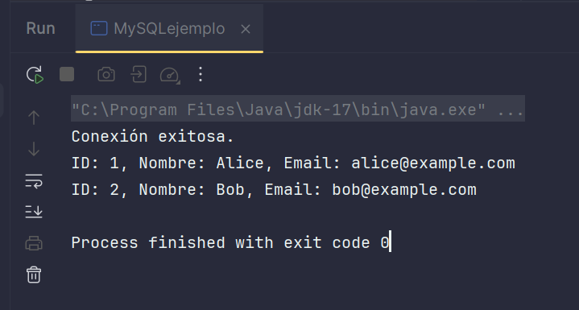
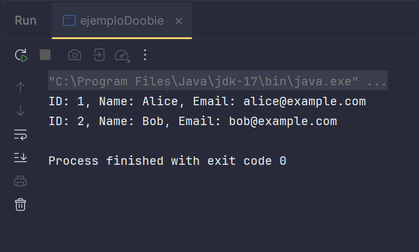

# JDBC y sus Componentes

**JDBC** (Java Database Connectivity) es una API de Java que permite a las aplicaciones conectarse y ejecutar operaciones en bases de datos relacionales. Proporciona un conjunto estándar de interfaces y clases para interactuar con diferentes sistemas de bases de datos. 

## Componentes principales de JDBC:

1. **Driver JDBC**: Una implementación específica para interactuar con un sistema de base de datos. Traducen las llamadas JDBC en comandos que el sistema de base de datos entiende.
2. **Connection**: Representa una conexión a una base de datos. Se utiliza para enviar comandos SQL y recibir resultados.
3. **Statement**: Permite ejecutar consultas SQL. Incluye subtipos como `PreparedStatement` y `CallableStatement` para operaciones más complejas.
4. **ResultSet**: Contiene los resultados de una consulta SQL y permite iterar sobre ellos.
5. **SQLException**: Maneja errores que ocurren durante las operaciones de la base de datos.

---

# Librerías de Scala para Conectarse a Bases de Datos Relacionales

| Librería       | Descripción                                                                                  | Ventajas                                                                                                     | Desventajas                                                                                              |
|----------------|----------------------------------------------------------------------------------------------|-------------------------------------------------------------------------------------------------------------|---------------------------------------------------------------------------------------------------------|
| **Slick**     | Una librería funcional que permite interactuar con bases de datos relacionales usando un DSL. | Soporte funcional y tipos seguros. Integra soporte para múltiples bases de datos. Fácil de usar con patrones funcionales. | Puede ser compleja para usuarios nuevos.                                                                 |
| **Doobie**    | Librería que facilita la interacción con bases de datos desde un enfoque funcional.           | Integra con Cats y Cats Effect. Tipos seguros en las consultas. Excelente manejo de errores.               | Requiere comprensión de conceptos funcionales avanzados.                                                 |
                                            

---

# Conexión a una Base de Datos Relacional (MySQL)


## 1. Generar una base de datos en MySQL

Ejecute los siguientes comandos SQL en su cliente de MySQL:
```sql
CREATE DATABASE scala_test;
USE scala_test;
CREATE TABLE users (
    id INT AUTO_INCREMENT PRIMARY KEY,
    name VARCHAR(50) NOT NULL,
    email VARCHAR(50) UNIQUE NOT NULL
);

INSERT INTO users (name, email) VALUES
('Alice', 'alice@example.com'),
('Bob', 'bob@example.com');
```

## 2. Configuración en Scala

### Dependencias
Agregar las dependencias necesarias en el archivo `build.sbt`:
```scala
libraryDependencies ++= Seq(
  "mysql" % "mysql-connector-java" % "8.0.33",
  "org.tpolecat" %% "doobie-core" % "1.0.0-RC1"
)
```

### Código para Conectarse
Crear una conexión y realizar una consulta básica:

```scala
import java.sql.{Connection, DriverManager, ResultSet}

object MySQLejemplo {
  def main(args: Array[String]): Unit = {
    val url = "jdbc:mysql://localhost:3306/scala_test"
    val user = "root"
    val password = "kirby1150682860"

    var connection: Connection = null

    try {
      Class.forName("com.mysql.cj.jdbc.Driver")

      connection = DriverManager.getConnection(url, user, password)
      println("Conexión exitosa.")

      val statement = connection.createStatement()
      val resultSet: ResultSet = statement.executeQuery("SELECT * FROM users")

      while (resultSet.next()) {
        val id = resultSet.getInt("id")
        val name = resultSet.getString("name")
        val email = resultSet.getString("email")
        println(s"ID: $id, Nombre: $name, Email: $email")
      }

    } catch {
      case e: Exception => e.printStackTrace()
    } finally {
      
      if (connection != null) connection.close()
    }
  }
}

```


### Explicación del código
1. **Configuración:**
   - url: URL de conexión JDBC (localhost, puerto 3306, base de datos scala_test).
    - user y password: Credenciales de la base de datos.
2. **Cargar el Driver JDBC:**
    - Class.forName("com.mysql.cj.jdbc.Driver") carga el driver necesario para conectarse a MySQL.
3. **Establecer Conexión:**
    - DriverManager.getConnection(url, user, password) crea la conexión con la base de datos.
4. **Consulta SQL:**
    - statement.executeQuery("SELECT * FROM users") ejecuta la consulta SQL.
    Se itera sobre el ResultSet para mostrar los datos.
5. **Cerrar Conexión:**
    En el bloque finally, la conexión se cierra para liberar recursos.


### Ejemplo con Doobie
```scala
import doobie._
import doobie.implicits._
import cats.effect.IO
import cats.effect.unsafe.implicits.global

object ejemploDoobie {
  def main(args: Array[String]): Unit = {
    // Definir configuración de la base de datos
    val xa = Transactor.fromDriverManager[IO](
      "com.mysql.cj.jdbc.Driver",   
      "jdbc:mysql://localhost:3306/scala_test", 
      "root",                        
      "kirby1150682860"                     
    )
    
    val query = sql"SELECT * FROM users".query[(Int, String, String)].to[List]
    
    val result = query.transact(xa).unsafeRunSync()
    
    result.foreach { case (id, name, email) =>
      println(s"ID: $id, Name: $name, Email: $email")
    }
  }
}
```


### Explicación del Código
1. **Transactor**: Configura la conexión a la base de datos.
2. **Consulta SQL**: Se define una consulta segura con el interpolador `sql` de Doobie.
3. **Ejecución**: Se ejecuta la consulta en el contexto de `IO` y se imprimen los resultados.

---

## Conclusión

### JDBC
Es una solución básica y directa para conectarte a bases de datos en Scala, pero requiere manejar manualmente conexiones, errores y recursos, lo que puede ser tedioso y propenso a errores en proyectos grandes.

### Doobie
Doobie es una alternativa funcional más robusta:
- **Manejo seguro de recursos** con Cats Effect.
- **Consultas declarativas** más limpias y reutilizables.
- **Validación de SQL** en tiempo de compilación.
- **Soporte nativo para transacciones**.

## Referencias
1. [https://www.baeldung.com/scala/doobie-intro](https://www.baeldung.com/scala/doobie-intro)  
2. [https://rockthejvm.com/articles/learning-doobie-for-the-greater-good](https://rockthejvm.com/articles/learning-doobie-for-the-greater-good)
3. [https://alvinalexander.com/scala/scala-jdbc-connection-mysql-sql-select-example/](https://alvinalexander.com/scala/scala-jdbc-connection-mysql-sql-select-example/)


